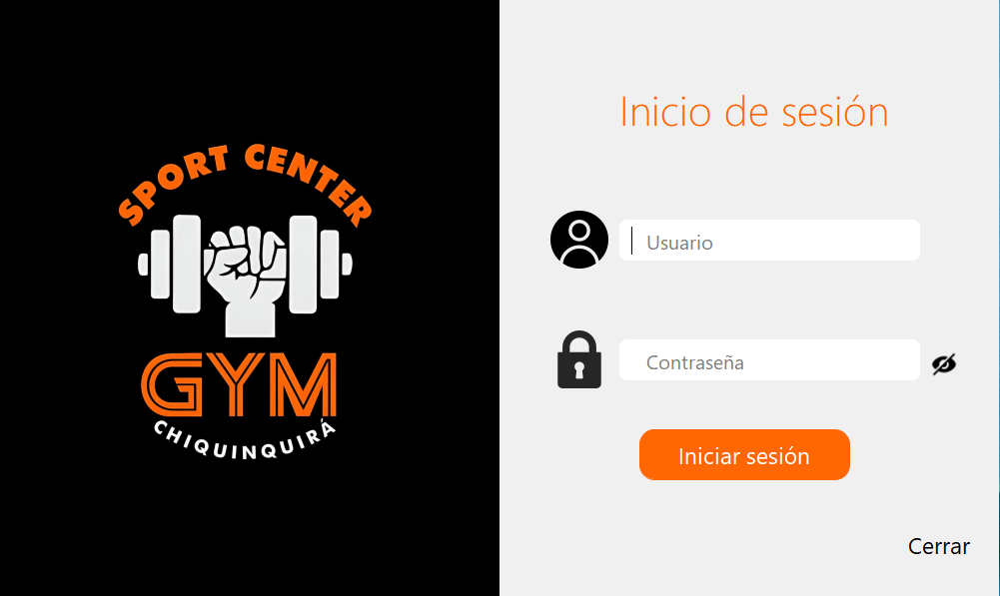
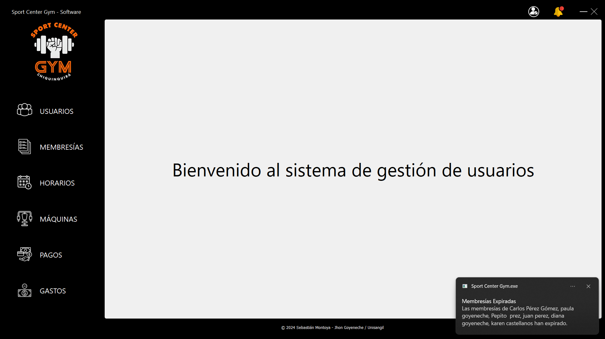

# 🏋️‍♂️ Sport Center Gym - Software de Gestión

Este fue mi proyecto de grado realizado en conjunto con Sebastian Montoya, un sistema de escritorio para la gestión operativa de un gimnasio, desarrollado con **Python**, **PyQt5** y **MySQL**.

## 🚀 Funcionalidades principales

- Gestión de usuarios y entrenadores
- Registro de ingresos y pagos
- Control de asistencia
- Generación de reportes
- Interfaz amigable y responsive

## 🛠 Tecnologías utilizadas

- Python 3
- PyQt5
- MySQL
- MVC (Modelo Vista Controlador)

## 📦 Instalación

1. Clona este repositorio:
   ```bash
   git clone https://github.com/Goyo0201/SCG_Software.git

## 📸 Capturas de pantalla

### Inicio de sesión


### Panel principal

